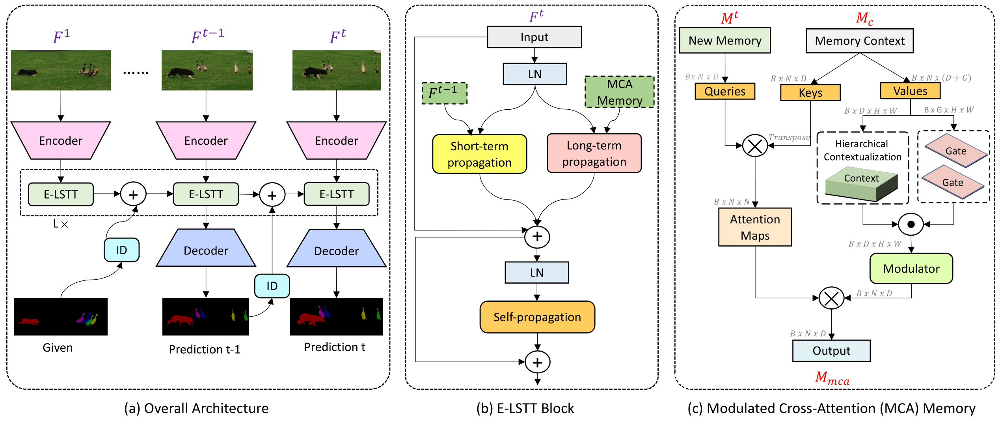
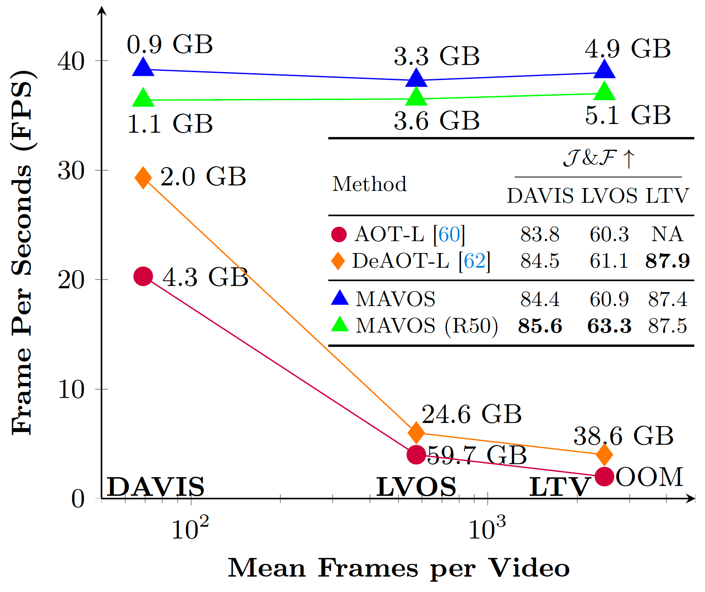
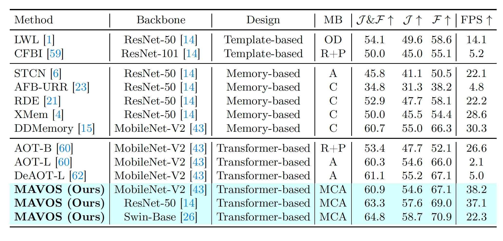
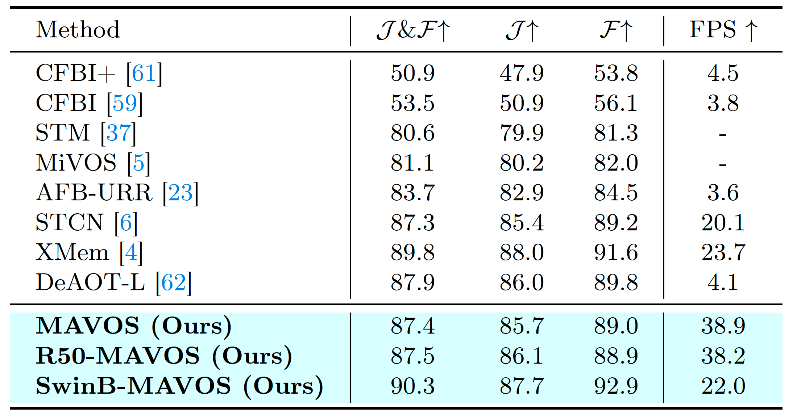

# MAVOS
### **Efficient Video Object Segmentation via Modulated Cross-Attention Memory**

<p align="center">
    
</p>

#### [Abdelrahman Shaker](https://amshaker.github.io), [Syed Talal Wasim](https://talalwasim.github.io/), [Martin Danelljan](https://martin-danelljan.github.io/), [Salman Khan](https://salman-h-khan.github.io/), [Ming-Hsuan Yang](https://scholar.google.com.pk/citations?user=p9-ohHsAAAAJ&hl=en) and [Fahad Khan](https://sites.google.com/view/fahadkhans/home)


#### **Mohamed bin Zayed University of AI, ETH Zurich, University of California - Merced, Yonsei University, Google Research, Linköping University**

<!-- [](site_url) -->
[](https://arxiv.org/pdf/2403.17937.pdf)

## Latest 
- `2024/03/24`: We released our technical report on [arxiv](https://arxiv.org/pdf/2403.17937.pdf). Our code and models are coming soon!

<br>
<details>
  <summary>
  <font size="+1">Abstract</font>
  </summary>
Recently, transformer-based approaches have shown promising results for semi-supervised video object segmentation. However, these approaches typically struggle on long videos due to increased GPU memory demands, as they frequently expand the memory bank every few frames. We propose a transformer-based approach, named MAVOS, that introduces an optimized and dynamic long-term modulated cross-attention (MCA) memory to model temporal smoothness without requiring frequent memory expansion. The proposed MCA effectively encodes both local and global features at various levels of granularity while efficiently maintaining consistent speed regardless of the video length. Extensive experiments on multiple benchmarks, LVOS, Long-Time Video, and DAVIS 2017, demonstrate the effectiveness of our proposed contributions leading to real-time inference and markedly reduced memory demands without any degradation in segmentation accuracy on long videos. Compared to the best existing transformer-based approach, our MAVOS increases the speed by 7.6x, while significantly reducing the GPU memory by 87% with comparable segmentation performance on short and long video datasets. Notably on the LVOS dataset, our MAVOS achieves a J&F score of 63.3% while operating at 37 frames per second (FPS) on a single V100 GPU. Our code and models will be publicly released.
</details>

## Intro

- **MAVOS** is a transformer-based VOS method that achieves real-time FPS and reduced GPU memory for long videos. We introduce a Modulated Cross-Attention (MCA) memory, designed to efficiently propagate information from past frames to the target. Our approach utilizes a novel fusion operator capable of effectively managing both local and global features across diverse levels of detail.




- **MAVOS**  increases the speed by 7.6x over the baseline DeAOT, while significantly reducing the GPU memory by 87% on long videos with comparable segmentation performance on short and long video datasets. 



## Examples


<br>


## Results on Long videos benchmarks
### LVOS val set


### LTV 



## Acknowledgment
The computations were enabled by resources provided by the National Academic Infrastructure for Supercomputing in Sweden (NAISS) at Alvis partially funded by the Swedish Research Council through grant agreement no. 2022-06725, the LUMI supercomputer hosted by CSC (Finland) and the LUMI consortium, and by the Berzelius resource provided by the Knut and Alice Wallenberg Foundation at the National Supercomputer Centre.

## Citation
if you use our work, please consider citing us:
```BibTeX
@article{Shaker2024MAVOS,
  title={Efficient Video Object Segmentation via Modulated Cross-Attention Memory},
  author={Shaker, Abdelrahman and Wasim, Syed and Danelljan, Martin and Khan, Salman and Yang, Ming-Hsuan and Khan, Fahad Shahbaz},
  journal={arXiv:2403.17937},
  year={2024}
}

```


## License
This project is released under the BSD-3-Clause license. See [LICENSE](LICENSE) for additional details.
